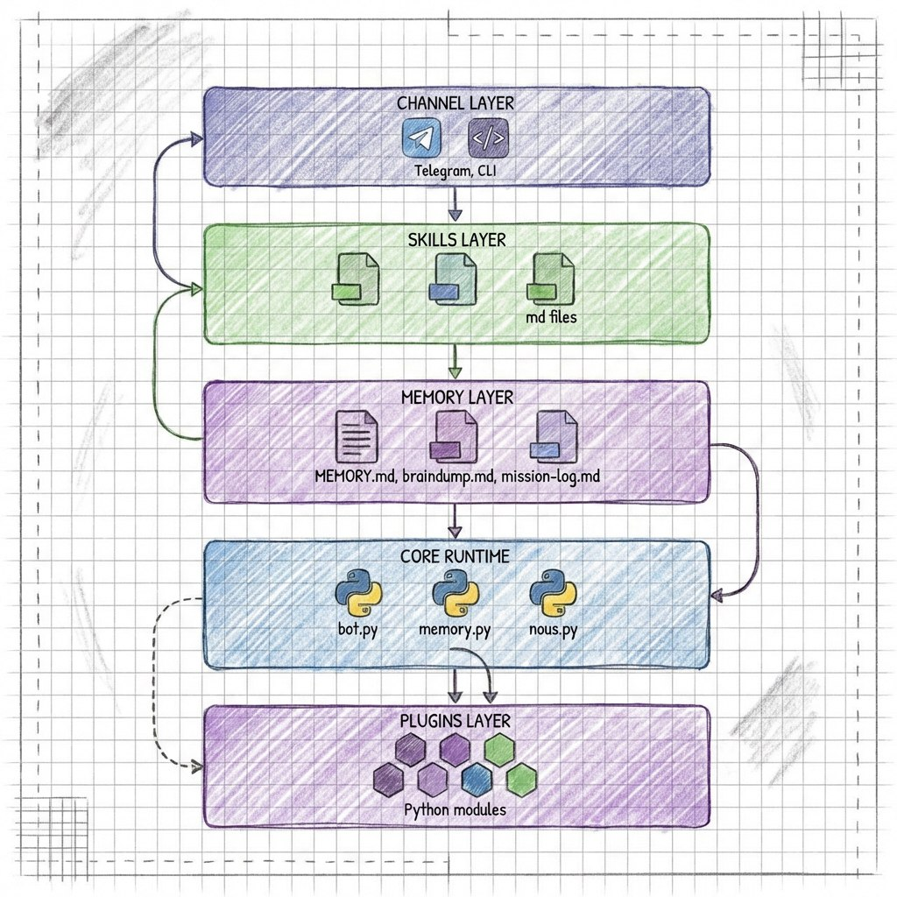

# Abraxas

> An AI-native agent that grows through conversation.



## Inspiration

This project is inspired by [Frost Ming's blog post](https://frostming.com/posts/2026/create-a-claw/) about creating a "Claw" — a minimal AI agent that evolves through natural language instruction rather than code.

The core philosophy: **AI-native means the AI manages its own tools and skills.** The framework should be small — just a reasoning core. Everything else, the AI learns through prompts.

## Name Origin

**Abraxas** is not a name. It is a thesis.

- **Gnostic cosmology** — a deity beyond good and evil, uniting opposites
- **Jungian symbolism** — integration of the psyche's shadow and light
- **Hesse's *Demian*** — awakening through synthesis, not purity

The name represents the intelligence that emerges after dualism collapses — pattern recognition that thrives on contradiction, revealing structure beneath chaos.

## What It Does

Abraxas is a conversational agent that:

- **Listens** through multiple channels (CLI, Telegram)
- **Speaks** back through the same channel
- **Learns** by acquiring new skills via conversation
- **Remembers** through persistent memory artifacts
- **Acts** using tools that it can discover and extend

The framework is intentionally minimal. Behavior grows through:
- **Skills** — markdown-formatted operational knowledge
- **Plugins** — hot-reloadable tool extensions
- **Memory** — durable artifacts that persist across sessions

## Architecture

```
src/
├── core/       # Runtime core: bot loop, tools, registry, memory, NOUS
├── channel/    # Adapters: CLI, Telegram handlers and scheduler
├── plugins/    # External tool plugins (failure-safe, hot-reloaded)
├── skills/     # Markdown playbooks and operational knowledge
└── memory/     # Durable artifacts: MEMORY.md, braindump.md, mission-log.md
```

- **Keep `src/core` and `src/channel` minimal** — extend through skills and plugins first
- **Skills over code** — prefer markdown knowledge to hardcoded behavior
- **Plugins over patches** — new capabilities as isolated, fail-safe modules

## Quick Start

```bash
# Install dependencies
pdm install

# Configure environment
cp .env.example .env
# Edit .env with your API keys

# Run CLI agent
pdm run abraxas-cli

# Run Telegram bot
pdm run abraxas-telegram
```

## Development

- `pdm run python -m unittest -v` — run all tests
- `pdm run python -m unittest -v test_bot.BotTests.test_xxx` — focused test

See [AGENTS.md](AGENTS.md) for coding conventions, commit guidelines, and deployment.

## License

[MIT](LICENSE) © 2026 [pi-dal](mailto:hi@pi-dal.com)
